# 📊 From Upload to Inbox — Billing Automation with AWS

This project is a fully automated, serverless billing system that extracts data from uploaded PDFs/images and sends real-time billing receipt emails — powered by AWS Cloud and Machine Learning.

---
 
# 🚀 Tech Stack
  
- **Amazon S3** – For storing uploaded bills (PDFs/Images)
- **AWS Lambda** – Core logic for processing and automation
- **Amazon Textract** – ML model for extracting key-value data from documents 
- **Amazon DynamoDB** – Stores structured billing data
- **Amazon SES** – Sends email receipts
- **IAM** – Secure roles and access control between services
- **Python** – Used for Lambda functions

---

# 📐📦 AWS Service Architecture

🧾 How It Works:

*Upload: A user uploads a receipt (PDF or image) to an S3 bucket.*

*Trigger: The upload event automatically triggers an AWS Lambda function.*

*Extraction: Lambda uses Amazon Textract to extract key details such as vendor, date, total amount, and line items.*

*Storage: The structured data is saved in Amazon DynamoDB for record-keeping.*

*Emailing: Finally, the data is formatted and sent to the user via Amazon SES as a receipt summary.*

---
# 💡 Features

- Upload a bill (PDF or image) to S3
- Automatically trigger a Lambda function
- Extract billing details using Amazon Textract
- Save the structured data to DynamoDB
- Email the receipt to the customer using SES
- 100% Serverless and real-time automation

---
# 🛠️ Setup Instructions
⚠️ Make sure you have appropriate AWS IAM access before proceeding.

1.Create an S3 Bucket

    Enable event trigger on object creation for Lambda

2.Deploy Lambda Function

   Add environment variables like:

    TABLE_NAME, SENDER_EMAIL, RECIPENT_EMAIL

  Attach IAM Role with access to:

    S3, Textract, DynamoDB, SES

3.Set Up DynamoDB

    Create a table with appropriate keys (e.g., invoice_id)

4.Verify Email in SES

     verify sender email addresses

---

# 📌 Key Takeaways

S3: Learned how to trigger workflows on file uploads

DynamoDB: Understood fast, flexible NoSQL data modeling

IAM: Set up secure role-based access between AWS services

Lambda: Became confident in deploying/debugging serverless functions

Textract: Got hands-on with ML for document parsing

Environment Variables: One small typo in a key name caused a silent fail — painful but educational 😅
---

# 🖼️ 📷 Receipt Flow in Action

---

# 🔁 Workflow Overview

```mermaid
graph TD;
    A[📤File Uploaded to S3] --> B[⚙️Lambda Triggered]
    B --> C[🧠Amazon Textract Extracts Data]
    C --> D[💾Data Stored in DynamoDB]
    D --> E[✉️Email Sent via AmazonSES]
```

---
# 🧑‍💻 Connect With Me  
Hey! I'm Niharika B – Who loves building emotionally intelligent, visually rich applications ✨  

Let's connect and collaborate as diving into the ocean of knowledge brings nature and technology together 🚀:  

  
  
  
  
  

<!-- Footer Banner -->

